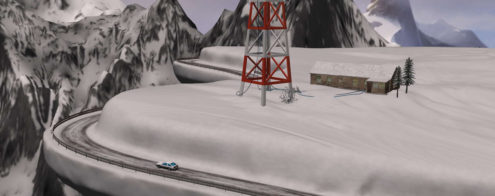
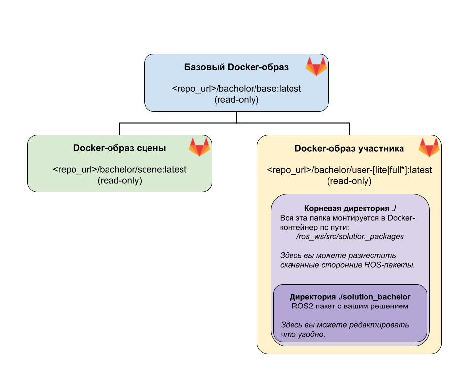

# Задание полуфинала олимпиады "Я - профессионал" 2024-2025 по робототехнике. Бакалавриат
      

---

---

Репозиторий содержит ROS-пакет `solution_bachelor` с минимальным *решением* задачи. Участнику следует, модифицируя этот пакет, решить задачу.

## Задача

В симуляции предоставляется зацикленный участок автомобильной дороги общего пользования и модель беспилотного транспортного средства для которой участникам предлагается реализовать алгоритм управления, позволяющий за ограниченное время проехать как можно больший путь.

В состав доступной бортовой сенсорики модели беспилотного транспортного средства входят rgbd-камера и GNSS-RTK.

Для управления моделью беспилотного транспортного средства доступны воздействие на поворот рулевого колеса, торможение и ускорение. Управление автомобилем происходит посредством отправки сообщений типа `geometry_msgs/Twist` в топик `/cmd_vel`:
- лицейная скорость в сообщении используется как процент от максимального момента на ведущих (задних) колесах. 
- угловая скорость в сообщении используется как угол поворота колес в радианах (макс. +-0.6).

## Установка и настройка окружения
Для настройки окружения необходимо иметь одну из перечисленных операционных систем:
1. Ubuntu 20.04 или 22.04
2. Windows 10 и старше, с установленным WSL (Не рекомендуется).

Для подготовки окружения необходимо сделать следующее:
1. Установить docker-engine: [Docker Engine](https://docs.docker.com/engine/install/ubuntu/).  
2. Также необходимо установить docker-compose-plugin: [Docker Compose](https://docs.docker.com/compose/install/linux/).  
3. Если вы планируете использовать видеокарту, установите также nvidia-container-toolkit: [Nvidia Container Toolkit](https://docs.nvidia.com/datacenter/cloud-native/container-toolkit/install-guide.html)

## Первый запуск
1. **[Важно!]** Сделайте **fork** этого репозитория.
2. Склонируйте fork репозитория в рабочую директорию:
        git clone https://gitlab.com/{my-username}/bachelor.git
        cd bachelor

3. **[Важно!]** Перед запуском на Linux выполните следующую команду:

        xhost +local:docker

4. Для запуска сцены и этого пакета используйте команду:

        docker compose -f docker-compose.yaml up

    Для получения последней версии сцены(обновления), используейте флаг `--pull always`:

        docker compose -f docker-compose.yaml up --build --pull always

## Структура ROS-пакета и окружения

Для запуска docker-контейнеров используется инструмент docker-compose. Описание параметров запуска доступно в этом репозитории в файлах:

- `docker-compose.yaml ` - если у вас **нет** видеокарты *Nvidia*.
- `docker-compose.nvidia.yaml `. - если у вас есть видеокарта от *Nvidia*.

**[Важно!]** Модифицирование `docker-compose` файлов вне предложенных инструкций может привести к тому, что решение не будет запущено корректно при тестировании. Остальные файлы разрешается редактировать как угодно.

Доступны два docker-образа, на основе которых создаются два контейнера:
- scene: `registry.gitlab.com/roboforces-itmo/open-tasks/iprofi2025/problem/bachelor/scene:latest` - read-only образ, включающий сцену и робота в gazebo. Образ скачивается из реестра gitlab.
- solution: 
    docker-образ для решения также является read-only и имеет два варианта:
        - lite(легкий): `registry.gitlab.com/roboforces-itmo/open-tasks/iprofi2025/problem/bachelor/user-lite:latest` -- Включает в себя базовые пакеты для работы с PointCloud и бибилиотеки машинного зрения 
        - full(тяжелый): `registry.gitlab.com/roboforces-itmo/open-tasks/iprofi2025/problem/bachelor/user-full[cuda|noncuda]:latest` -- Включает в себя расширенный набор библиотек, включая torch, ultralitics, onnx и тд.

Участникам предоставляется шаблон с реализованными базовыми функциями чтения данных и управления в виде ROS-пакета `solution_bachelor`, который содержит код на C++ и на Python. Модифицируя его участникам предлагается решить задание.

**[Важно!]** По умолчанию `start.launch.py` запускает код на Python, чтобы писать код на C++ расскомментируйте и закомментируйте соответствующие строчки в `start.launch.py`.

### Ручное управление автомобилем

Иногда для удобство удобно в ручную поуправлять автомобилем. Для ручного телеуправления можно запустить управление с клавиатуры:
    
    ros2 run teleop_twist_keyboard teleop_twist_keyboard

Для `teleop_twist_keyboard` лицейная скорость используется как процент от максимального момента на ведущих (задних) колесах. Угловая скорость как угол поворота колес в радианах (макс. 0.6).

В таком режиме:
- Клавишами `I-K-M` активируется газ-тормоз-назад. Уровень момента на колесах задается клавишами: `w-x`
- Клавишами `J-L` активируется поворот колес. Угол, на который поворачиваются колеса задается клавишами: `e-c`

## Описание работы с docker-compose

В файле `docker-compose.yaml` хранится описание параметров запуска сцены и решения.  
Для выбора расширенного образа библиотек вам необходимо закомментировать следующую строчку в `docker-compose*.yaml` файле:

    image: registry.gitlab.com/roboforces-itmo/open-tasks/iprofi2025/problem/bachelor/user-lite:latest

и раскомментировать следующую:

    image: registry.gitlab.com/roboforces-itmo/open-tasks/iprofi2025/problem/bachelor/user-full[cuda|noncuda]:latest

### Автозапуск решения
По умолчанию для решения **автоматически** запускается `start.launch`.

    ros2 launch solution_bachelor start.launch

Вы можете убрать автозапуск решения и делать это вручную, для этого раскомментируйте следующую строчку в `docker-compose*.yaml` файле:

    # command: /bin/bash # Раскомментируй для ручного запуска

После этого чтобы подключиться к контейнеру или открыть больше терминалов в docker контейнере решения необходимо ввести:

    docker compose exec solution bash

### Быстрый перезапуск решения
Если используется **автозапуск** решения. Для быстрого изменения и пересборки отредактируйте необходимые файлы и в соседней вкладке перезапустите сервис решения с помощью команды:

    docker compose restart solution

### Быстрый перезапуск сцены
Иногда хочется перзапустить сцену, в таком случае используйте:

    docker compose restart scene
